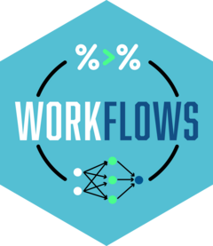

<!-- README.md is generated from README.Rmd. Please edit that file -->

```{r, include = FALSE}
knitr::opts_chunk$set(
  collapse = TRUE,
  comment = "#>",
  fig.path = "man/figures/README-",
  out.width = "100%"
)
```

# workflows <a href='https://workflows.tidymodels.org'></a>

<!-- badges: start -->
[](https://app.codecov.io/gh/tidymodels/workflows?branch=main)
[](https://github.com/tidymodels/workflows/actions/workflows/R-CMD-check.yaml)
<!-- badges: end -->

## What is a workflow? 

A workflow is an object that can bundle together your pre-processing, modeling, and post-processing requests. For example, if you have a `recipe` and `parsnip` model, these can be combined into a workflow. The advantages are:

 * You don't have to keep track of separate objects in your workspace.

 * The recipe prepping, model fitting, and postprocessor estimation (which may include data splitting) can be executed using a single call to `fit()`.

 * If you have custom tuning parameter settings, these can be defined using a simpler interface when combined with [tune](https://github.com/tidymodels/tune).
 
## Installation

You can install workflows from CRAN with:

``` r
install.packages("workflows")
```


You can install the development version from [GitHub](https://github.com/) with:

``` r
# install.packages("pak")
pak::pak("tidymodels/workflows")
```
 
## Example

Suppose you were modeling data on cars. Say...the fuel efficiency of 32 cars. You know that the relationship between engine displacement and miles-per-gallon is nonlinear, and you would like to model that as a spline before adding it to a Bayesian linear regression model. You might have a recipe to specify the spline:

```{r spline-rec, eval = FALSE}
library(recipes)
library(parsnip)
library(workflows)

spline_cars <- recipe(mpg ~ ., data = mtcars) |> 
  step_ns(disp, deg_free = 10)
```

and a model object:

```{r car-mod, eval = FALSE}
bayes_lm <- linear_reg() |> 
  set_engine("stan")
```

To use these, you would generally run:

```{r car-fit, eval = FALSE}
spline_cars_prepped <- prep(spline_cars, mtcars)
bayes_lm_fit <- fit(bayes_lm, mpg ~ ., data = juice(spline_cars_prepped))
```

You can't predict on new samples using `bayes_lm_fit` without the prepped version of `spline_cars` around. You also might have other models and recipes in your workspace. This might lead to getting them mixed-up or forgetting to save the model/recipe pair that you are most interested in.

workflows makes this easier by combining these objects together:

```{r wflow, eval = FALSE}
car_wflow <- workflow() |> 
  add_recipe(spline_cars) |> 
  add_model(bayes_lm)
```

Now you can prepare the recipe and estimate the model via a single call to `fit()`:

```{r wflow-fit, eval = FALSE}
car_wflow_fit <- fit(car_wflow, data = mtcars)
```

You can alter existing workflows using `update_recipe()` / `update_model()` and `remove_recipe()` / `remove_model()`.


## Contributing

This project is released with a [Contributor Code of Conduct](https://contributor-covenant.org/version/2/0/CODE_OF_CONDUCT.html). By contributing to this project, you agree to abide by its terms.

- For questions and discussions about tidymodels packages, modeling, and machine learning, please [post on Posit Community](https://community.rstudio.com/new-topic?category_id=15&tags=tidymodels,question).

- If you think you have encountered a bug, please [submit an issue](https://github.com/tidymodels/workflows/issues).

- Either way, learn how to create and share a [reprex](https://reprex.tidyverse.org/articles/articles/learn-reprex.html) (a minimal, reproducible example), to clearly communicate about your code.

- Check out further details on [contributing guidelines for tidymodels packages](https://www.tidymodels.org/contribute/) and [how to get help](https://www.tidymodels.org/help/).
